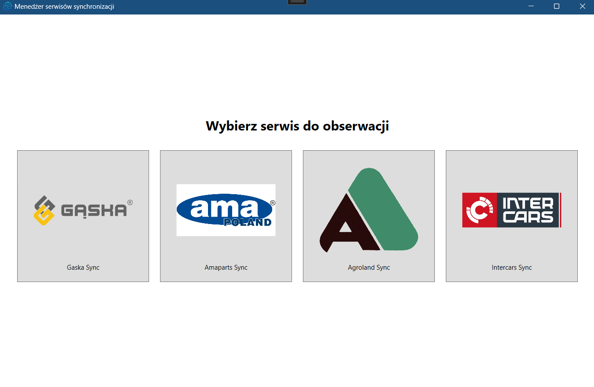
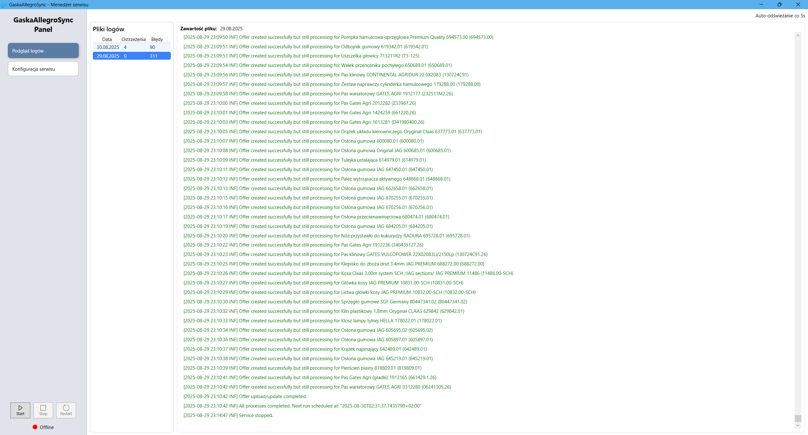
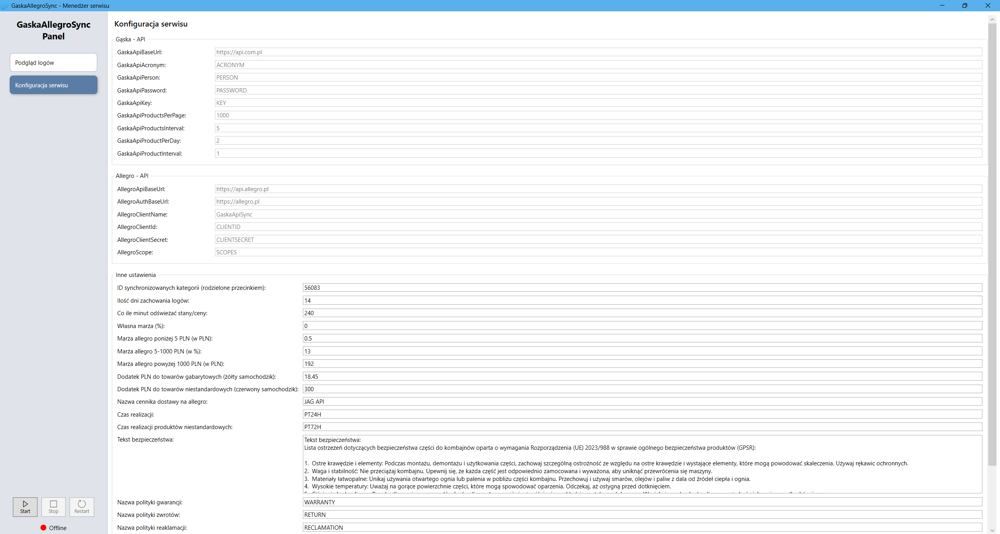

# TechagroSyncServices

> 💼 **Commercial Project** — part of a private or client-facing initiative.

## Overview

**TechagroSyncServices** is a set of Windows Services that integrate with multiple supplier APIs to automatically fetch data and insert it into a database.  
Each service is independently responsible for processing a different supplier’s API and is fully logged using **Serilog**.

Additionally, the project includes a **Service Manager**, a user-facing interface that allows users to:

- Select which service they want to observe
- View structured logs in real-time
- Start, stop, or restart services
- Monitor service status
- View or modify service configuration settings

This makes monitoring and managing all services simple and intuitive.

## Services

- **GaskaSyncService**

  - Fetches data from the **Gaska API** (JSON format)
  - Inserts parsed records into the database

- **AgrolandSyncService**

  - Fetches data from the **Agroland API** (XML format)
  - Transforms and stores results in the database

- **AmapartsSyncService**

  - Reads data from **Ama-parts CSV files** downloaded from their website (CSV format)
  - Cleans and inserts data into the database

- **IntercarsSyncService**

  - Reads data from **Intercars CSV files** downloaded from their website (CSV format)
  - Cleans and inserts data into the database

- **AgroramiSyncService**

  - Fetches data from the **Agrorami GraphQL API** (JSON format)
  - Transforms and stores results in the database

- **HermonSyncService**

  - Reads data from **Hermon FTP** (CSV format) and **Hermon API** (JSON format)
  - Cleans and inserts data into the database

- **RolmarSyncService**

  - Reads data from **Rolmar API** (JSON format)
  - Transforms and stores results in the database

## Features

- Automated supplier data synchronization
- Format-specific parsing (JSON, XML, CSV)
- Structured logging with **Serilog**
- Reliable database integration

## Screenshots

### Configurator - Choosing Service View

### Configurator - Log View

### Configurator - Settings

## Technologies Used

- **Frameworks:** .NET Framework
- **Languages:** C#
- **Data Sources:** JSON, XML, CSV APIs
- **Database:** SQL Server
- **Logging:** Serilog

## License

This project is proprietary and confidential. See the [LICENSE](LICENSE) file for more information.

---

© 2025-present [calKU0](https://github.com/calKU0)
